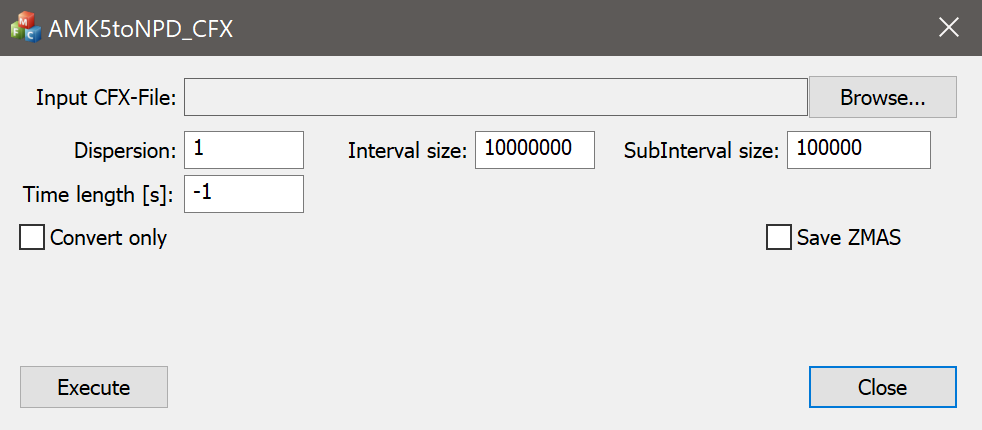

# NPD_convertor
Convertor from VLBI raw data formats to complex raw VLBI data format NPD

This program converts raw data of the VLBI observations into a complex format while performing coherent dispersion compensation. This utility can be useful for processing VLBI data with the effects of interstellar dispersion, such as observations of the pulsars or fast radio bursts. This program runs on Windows 7 and above.

There is screenshot of converter GUI:

# Table of contents
- [Installation](#Installation)
- [How to use](#How-to-use)
- [Link to the paper](#Link-to-the-paper)

# Installation

To start the converter, just download the NPD_converter.zip file, unpack the archive and run NPD_converter.exe.

# How to use

"Input CFX-File" - The path to the ASC Correlator configuration file .cfx file. View example.cfx or read the [paper](https://doi.org/10.1142/S2251171717500040) for more details.

"Dispersion" - Disperse measure (DM) in the direction to the pulsar.

"Interval size" - The number of samples in the data from which the Fourier transform is taken.

"SubInterval size" - The number of samples in the data for which the floating average is calculated for the automatic gain control algorithm.

"Time length" - The number of seconds of data to be converted, the default value -1 means that all data must be converted.

"Convert only" - Checked checkbox means that the data must be converted without using the automatic gain control algorithm.

"Save ZMAS" - Checked checkbox means that in addition to the converted data, a text file will be created with a table function used in the automatic gain calculation algorithm (for debugging purposes only)

"Execute" - start convertstion.

"Close" - close the program.

# Link to the paper

More details about this software in paper (Link will be availible later)

